(raw-proc)=

# 原始数据处理

(introduction-raw-data-processing-key-takeaway-1)=

## 动机

单细胞 {term}`sequencing` 中的原始数据处理将测序仪输出（所谓的泳道解复用 {term}`FASTQ` 文件）转换为易于分析的表示形式，例如计数矩阵。
该矩阵表示每个量化细胞中每个基因衍生的不同分子的估计数量，有时按每个分子的推断剪接状态进行分类 ({numref}`raw-proc-fig-overview`)。

:::{figure-md} raw-proc-fig-overview


本章讨论主题的概述。图中，"txome"代表转录组。
:::

计数矩阵是各种 scRNA-seq 分析 {cite}`Zappia2021_raw` 的基础，包括细胞类型鉴定或发育轨迹推断。
稳健且准确的计数矩阵对于可靠的 {term}`downstream analyses <Downstream analysis>` 至关重要。
此阶段的错误可能导致基于遗漏信号或数据中扭曲信号的无效结论和发现。
尽管输入（FASTQ 文件）和所需输出（计数矩阵）的性质看似简单，但原始数据处理面临若干技术挑战。

在本节中，我们重点关注原始数据处理的关键步骤：

1. 读段比对/定位
2. 细胞条形码（CB）识别与校正
3. 通过 {term}`unique molecular identifiers (UMIs) <Unique Molecular Identifier (UMI)>` 估计分子计数

我们还讨论了每个步骤中涉及的挑战和权衡。

```{admonition} 关于前置步骤的说明

原始数据处理的起点在某种程度上是任意的。在本书中，我们将泳道解复用后的 FASTQ 文件视为_原始_输入。
然而，这些文件源自更早的步骤，如碱基识别和碱基质量评估，这些步骤可能会影响下游处理。
例如，碱基识别错误和索引跳跃 {cite}`farouni2020model` 可能会在 FASTQ 数据中引入不准确性。
这些问题可以通过计算方法 {cite}`farouni2020model` 或实验改进（如[双索引](https://www.10xgenomics.com/blog/sequence-with-confidence-understand-index-hopping-and-how-to-resolve-it)）来缓解。

在此，我们不深入探讨上游过程，而是将从（例如）BCL 文件通过[适当工具](https://support.10xgenomics.com/single-cell-gene-expression/software/pipelines/latest/using/bcl2fastq-direct)转换得到的 FASTQ 文件视为所考虑的原始输入。
```

## 原始数据质量控制

获得原始 FASTQ 文件后，评估测序读段的质量非常重要。
执行此操作的一种快速有效的方法是使用 `FastQC` 等质量控制（QC）工具。
`FastQC` 为每个 FASTQ 文件生成详细报告，总结关键指标，例如质量分数、碱基含量和其他有助于识别文库制备或测序中潜在问题的统计数据。

虽然许多现代单细胞数据处理工具包含一些内置的质量检查——例如评估序列的 N 含量或比对读段的比例——但运行独立的 QC 检查仍然是良好的实践。

对于想了解典型的 `FastQC` 报告是什么样的读者，在以下折叠内容中，我们使用 `FastQC` [手册页面](https://www.bioinformatics.babraham.ac.uk/projects/fastqc/) 提供的[高质量](https://www.bioinformatics.babraham.ac.uk/projects/fastqc/good_sequence_short_fastqc.html)和[低质量](https://www.bioinformatics.babraham.ac.uk/projects/fastqc/bad_sequence_fastqc.html) Illumina 数据的示例报告，以及来自 [MSU RTSF](https://rtsf.natsci.msu.edu/genomics/technical-documents/fastqc-tutorial-and-faq.aspx)、[HBC 培训项目](https://hbctraining.github.io/Intro-to-rnaseq-hpc-salmon/lessons/qc_fastqc_assessment.html)和 [QC Fail 网站](https://sequencing.qcfail.com/software/fastqc/) 的教程和说明，来演示 `FastQC` 报告中的各个模块。
尽管这些教程并非专门为单细胞数据制作，但许多结果仍然与单细胞数据相关，需要注意以下几点。

在折叠部分中，除特别说明外，所有图表均取自 `FastQC` [手册页面](https://www.bioinformatics.babraham.ac.uk/projects/fastqc/) 上的示例报告。

值得注意的是，FastQC 报告中的许多 QC 指标仅对生物学读段（即源自基因转录本的读段）最有意义。
对于单细胞数据集，如 10x Chromium v2 和 v3，这通常对应于 read 2（文件名中包含 `R2` 的文件），其中包含转录本来源的序列。
相比之下，包含条形码和 UMI 序列的技术读段通常不表现出生物学典型的序列或 GC 含量。
然而，某些指标（如 `N` 碱基检出的比例）仍然与所有读段相关。

```{dropdown} FastQC 示例报告和教程

**0. 摘要**

HTML 报告左侧的摘要面板显示模块名称以及提供模块结果快速评估的符号。
然而，`FastQC` 对所有测序平台和生物材料应用统一的阈值。
因此，高质量数据可能出现警告（橙色感叹号）或失败（红色叉号），而有问题的数据却可能获得通过（绿色对勾）。
因此，在得出关于数据质量的结论之前，应仔细审查每个模块。

:::{figure-md} raw-proc-fig-fastqc-summary
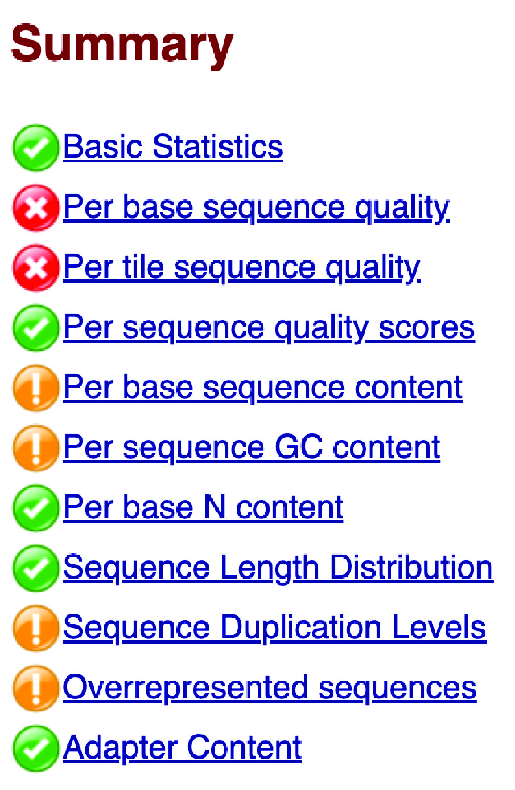

一个质量较差示例的摘要面板。
:::

**1. 基本统计信息**

基本统计信息模块提供输入 FASTQ 文件的关键信息和统计概览，包括文件名、序列总数、低质量序列数、序列长度以及所有序列中所有碱基的总体 GC 含量（%GC）。
高质量的单细胞数据通常具有极少的低质量序列，并且序列长度均匀。
此外，GC 含量应与被测序物种的基因组或转录组的预期 GC 含量一致。

:::{figure-md} raw-proc-fig-fastqc-basic-statistics
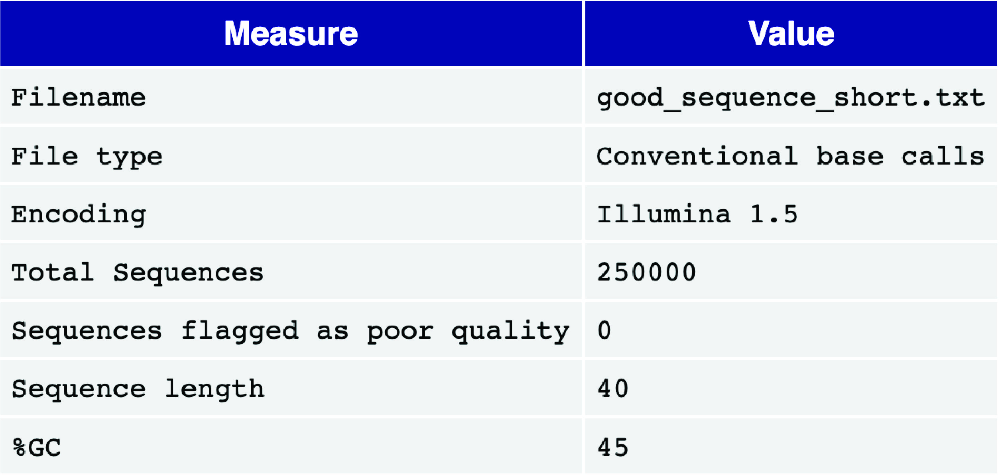

一个良好基本统计信息报告的示例。
:::

**2. 每个碱基位置的序列质量**

每个碱基位置的序列质量视图为读段中的每个位置显示一个箱线图。
x 轴表示读段内的位置，而 y 轴显示质量分数。

对于高质量的单细胞数据，黄色箱子——代表质量分数的四分位距——应落在绿色区域（表示高质量碱基识别）。
同样，代表分布第 10 和第 90 百分位数的须线也应保持在绿色区域内。
通常可以观察到质量分数沿读段长度逐渐下降，由于 {term}`信噪比 <signal-to-noise ratio>` 降低（这是边合成边测序方法的特征），末尾一些位置的碱基识别可能落入橙色区域（可接受的质量）。
但是，箱子不应延伸到红色区域（低质量碱基识别）。

如果观察到低质量碱基识别，可能需要进行质量修剪。关于测序错误模式的[更详细解释](https://hbctraining.github.io/Intro-to-rnaseq-hpc-salmon/lessons/qc_fastqc_assessment.html)可以在 [HBC 培训项目](https://hbctraining.github.io/main/) 中找到。

:::{figure-md} raw-proc-fig-fastqc-per-read-sequence-quality
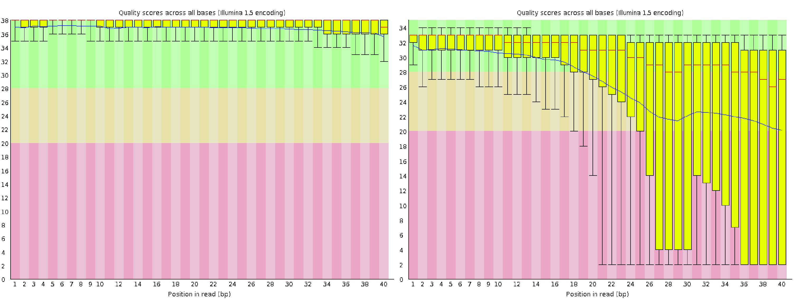

良好（左）和较差（右）的每个读段序列质量图。
:::

**3. 每个 tile 的序列质量**

对于使用 Illumina 文库的数据，每个 tile 的序列质量图突出显示了每个 {term}`Flowcell` [tile](https://www.biostars.org/p/9461090/)（{term}`流动槽 <Flowcell>` 的微型成像区域）中读段质量与平均值的偏差。
该图使用颜色梯度来表示偏差，暖色表示较大的偏差。
高质量数据通常在整个图中显示均匀的蓝色，表明流动槽所有 tile 的质量一致。

如果某些区域出现暖色，则表明只有部分流动槽经历了较差的质量。
这可能是由测序过程中的瞬时问题引起的，例如气泡通过流动槽或流动槽通道内的污迹和碎屑。
如需进一步调查，请参考 [QC Fail](https://sequencing.qcfail.com/articles/position-specific-failures-of-flowcells/) 和 `FastQC` 手册中提供的[警告常见原因](https://www.bioinformatics.babraham.ac.uk/projects/fastqc/Help/3%20Analysis%20Modules/12%20Per%20Tile%20Sequence%20Quality.html)等资源。

:::{figure-md} raw-proc-fig-fastqc-per-tile-sequence-quality
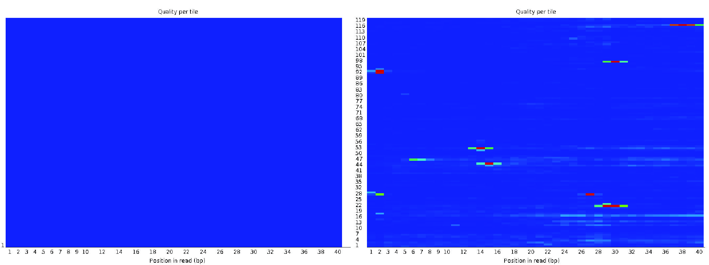

良好（左）和较差（右）的每个 tile 序列质量视图。
:::

**4. 每个序列的质量分数**

每个序列的质量分数图显示文件中每个读段平均质量分数的分布。
x 轴表示平均质量分数，而 y 轴显示每个分数的频率。
对于高质量数据，该图应在高质量端附近有一个单峰。
如果出现额外的峰，则可能表明存在一部分有质量问题的读段。

:::{figure-md} raw-proc-fig-fastqc-per-sequence-quality-scores
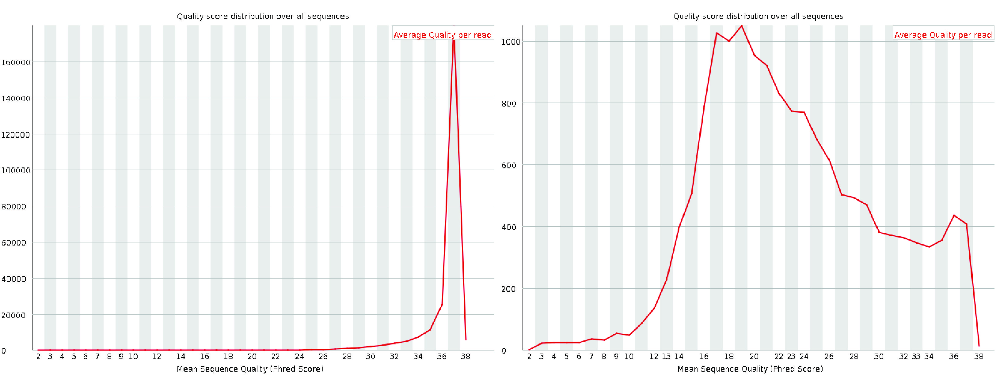

良好（左）和较差（右）的每个序列质量分数图。
:::

**5. 每个碱基位置的序列含量**

每个碱基位置的序列含量图显示文件中所有读段每个碱基位置上每种核苷酸（A、T、G 和 C）被检出的百分比。
对于单细胞数据，通常会在读段开头观察到波动。
这是因为初始碱基代表引物位点的序列，这些序列通常并非完全随机。
这在 RNA-seq 文库中经常出现，即使 `FastQC` 可能会用警告或失败标记，如 [QC Fail 网站](https://sequencing.qcfail.com/articles/positional-sequence-bias-in-random-primed-libraries/) 所述。

:::{figure-md} raw-proc-fig-fastqc-per-base-sequence-content
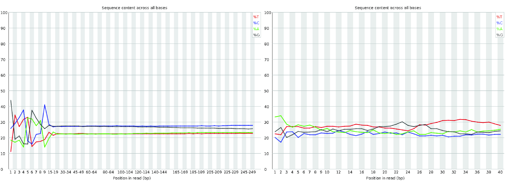

良好（左）和较差（右）的每个碱基位置序列含量图。
:::

**6. 每个序列的 GC 含量**

每个序列的 GC 含量图显示所有读段的 GC 含量分布（红色）与理论分布（蓝色）的对比。
观测分布的中心峰应与转录组的总体 GC 含量一致。
然而，由于转录组的 GC 含量与基因组的预期 GC 分布之间存在差异，观测分布可能比理论分布更宽或更窄。
这种变化很常见，即使数据是可接受的，也可能触发 `FastQC` 的警告或失败。

然而，该图中复杂或不规则的分布通常表明文库中存在污染。
还需要注意的是，在转录组学中解释 GC 含量可能具有挑战性。
预期的 GC 分布不仅取决于转录组的序列组成，还取决于样本中的基因表达水平，而这些通常在事先是未知的。
因此，在 RNA-seq 数据中，与理论分布存在一些偏差并不罕见。

:::{figure-md} raw-proc-fig-fastqc-per-sequence-gc-content
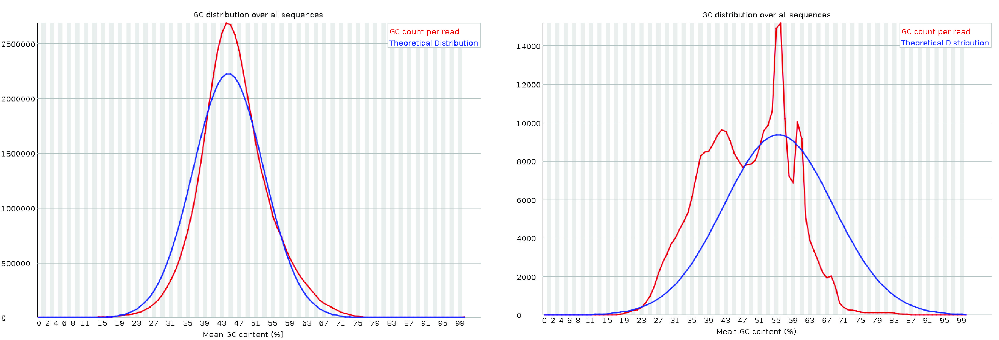

良好（左）和较差（右）的每个序列 GC 含量图。
左图来自 [MSU RTSF](https://rtsf.natsci.msu.edu/genomics/technical-documents/fastqc-tutorial-and-faq.aspx)。
右图取自 [HBC 培训项目](https://hbctraining.github.io/Intro-to-rnaseq-hpc-salmon/lessons/qc_fastqc_assessment.html)。
:::

**7. 每个碱基位置的 N 含量**

每个碱基位置的 N 含量图显示每个位置上被检出为 ``N`` 的碱基百分比，表明测序仪缺乏足够的置信度来指定具体的核苷酸。
在高质量的文库中，``N`` 含量应在读段的整个长度上始终保持为零或接近零。
任何明显的非零 ``N`` 含量都可能表明测序质量或文库制备存在问题。

:::{figure-md} raw-proc-fig-fastqc-per-base-n-content
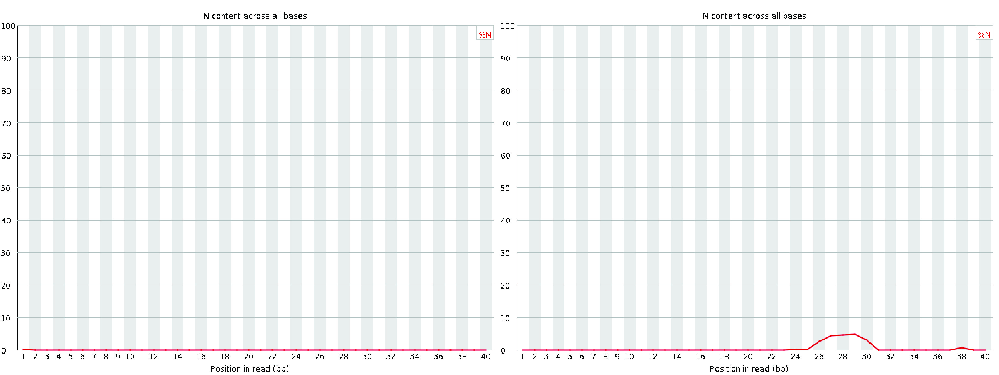

良好（左）和较差（右）的每个碱基位置 N 含量图。
:::

**8. 序列长度分布**

序列长度分布图显示文件中所有序列的读段长度分布。
对于大多数单细胞测序化学方法，所有读段预期具有相同的长度，导致图中出现一个单峰。
然而，如果在质量评估之前应用了质量修剪，可能会观察到读段长度的一些变化。
由于修剪导致的读段长度小差异是正常的，如果在预期范围内，不应引起担忧。

:::{figure-md} raw-proc-fig-fastqc-sequence-length-distribution
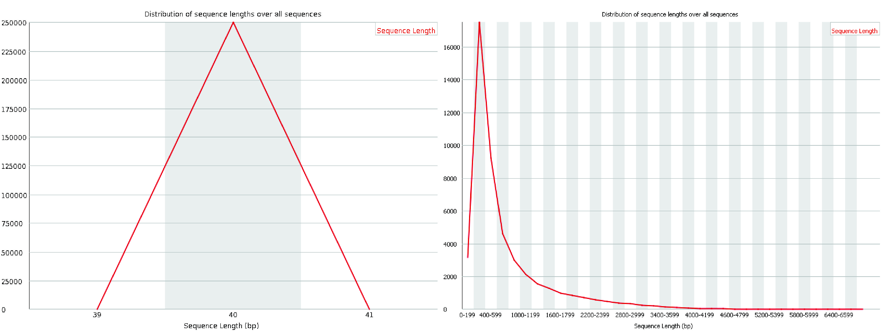

良好（左）和较差（右）的序列长度分布图。
:::

**9. 序列重复水平**

序列重复水平图以蓝线展示去重前后读段序列的重复水平分布。
在单细胞平台中，通常需要多轮 {term}`PCR`，且高表达基因天然产生大量转录本。
此外，由于 `FastQC` 不具备 UMI 感知能力（即不识别唯一分子标识符），一小部分序列显示高重复水平是常见的。

虽然这可能触发此模块的警告或失败，但并不一定表示数据存在质量问题。
然而，大多数序列仍应表现出低重复水平，反映出文库的多样性和良好制备。

:::{figure-md} raw-proc-fig-fastqc-sequence-duplication-levels
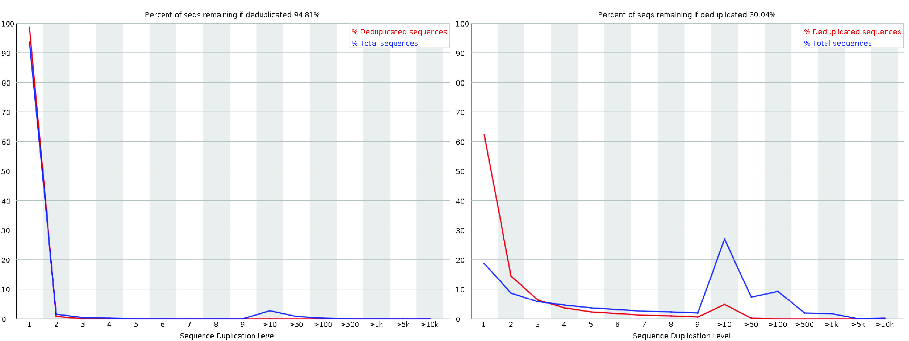

良好（左）和较差（右）的序列重复水平图。
:::

**10. 过度代表的序列**

过度代表的序列模块识别占总读段数超过 0.1% 的读段序列。
在单细胞测序中，一些过度代表的序列可能来自 PCR 过程中扩增的高表达基因。
然而，大多数序列不应过度代表。

如果确定了过度代表序列的来源（即未列为 "No Hit"），则可能表明文库中存在来自相应来源的潜在污染。
这种情况需要进一步调查以确保数据质量。

:::{figure-md} raw-proc-fig-fastqc-overrepresented-sequences
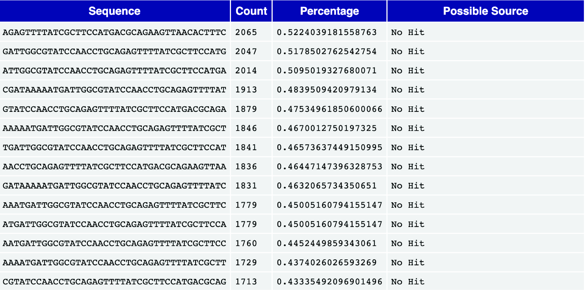

一个过度代表序列表的示例。
:::

**11. 接头含量**

接头含量模块显示每个碱基位置上含有 {term}`adapter sequences <Adapter sequences>` 的读段累计百分比。
高水平的接头序列表明在文库制备过程中接头去除不完全，这可能干扰下游分析。
理想情况下，数据中不应存在明显的接头含量。
如果接头序列丰富，可能需要额外的修剪来提高数据质量。

:::{figure-md} raw-proc-fig-fastqc-adapter-content
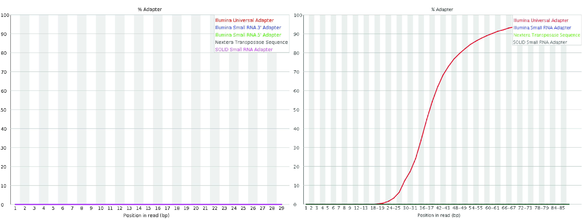

良好（左）和较差（右）的接头含量图。右图来自 [QC Fail 网站](https://sequencing.qcfail.com/articles/read-through-adapters-can-appear-at-the-ends-of-sequencing-reads/)。
:::

```

多个 FastQC 报告可以使用 [`MultiQC`](https://multiqc.info) 工具合并为一份报告。

(raw-proc:aln-map)=

## 比对与定位

比对或定位是单细胞原始数据处理的关键步骤。
它涉及确定每个测序片段的潜在 {term}`loci <Locus>` 来源，例如与读段序列紧密匹配的基因组或转录组位置。
此步骤对于正确将读段分配到其来源区域至关重要。

在单细胞测序方案中，原始序列文件通常包括：

- 细胞 {term}`Barcodes <Barcode>`（CB）：每个细胞的唯一标识符。
- 唯一分子标识符（UMI）：区分各个分子以校正扩增偏差的标签。
- 原始 {term}`cDNA <Complementary DNA (cDNA)>` 序列：从分子生成的实际读段序列。

作为第一步 ({numref}`raw-proc-fig-overview`)，准确的比对或定位对于可靠的下游分析至关重要。
此步骤中的错误，例如读段错误地比对到错误的转录本或基因，可能导致计数矩阵不准确或误导。

虽然将读段序列比对到参考序列的过程_远_早于 scRNA-seq 的发展，但现代 scRNA-seq 数据集的庞大规模——通常涉及数亿到数十亿条读段——使得这一步骤的计算量特别大。
许多现有的 RNA-seq 比对工具与实验方案无关，本质上不考虑 scRNA-seq 特有的特性，如细胞条形码、UMI 或其位置和长度。
因此，通常需要额外的工具来进行解复用和 UMI 解析等步骤 {cite}`Smith2017`。

为了解决 scRNA-seq 数据的比对和定位挑战，已开发了若干专门工具来自动或内部处理额外的处理需求。
这些工具包括：

- `Cell Ranger`（来自 10x Genomics 的商业软件）{cite}`raw:Zheng2017`
- `zUMIs` {cite}`zumis`
- `alevin` {cite}`Srivastava2019`
- `RainDrop` {cite}`niebler2020raindrop`
- `kallisto|bustools` {cite}`Melsted2021`
- `STARsolo` {cite}`Kaminow2021`
- `alevin-fry` {cite}`raw:He2022`

这些工具提供了用于比对 scRNA-seq 读段、解析技术读段内容（如细胞条形码和 UMI）、解复用和 UMI 解析的专门功能。
尽管它们提供了简化的用户界面，但其内部方法有显著差异。
一些工具生成传统的中间文件（如 {term}`BAM` 文件）并进一步处理，而另一些工具则完全在内存中运行或使用紧凑的中间表示以最小化输入/输出操作并减少计算开销。

虽然这些工具在具体算法、数据结构以及时间和空间复杂性的权衡上各不相同，但它们的方法通常可以沿两个维度进行分类：

1. **它们执行的比对类型**，以及
2. **读段所比对到的参考序列类型**。

(raw-proc:types-of-mapping)=

### 比对类型

我们重点介绍常用于比对 sc/snRNA-seq 数据的三种主要比对算法：剪接比对、连续比对和轻量级定位的变体。

首先，我们区分基于比对的方法和基于轻量级定位的方法 ({numref}`raw-proc-fig-alignment-mapping`)。
基于比对的方法使用各种启发式方法来识别读段可能来源的潜在基因座，然后通常使用动态规划算法对读段与参考序列之间的最佳核苷酸水平比对进行评分。

[全局比对](https://en.wikipedia.org/wiki/Needleman%E2%80%93Wunsch_algorithm)对整个查询和参考序列进行比对，而[局部比对](https://en.wikipedia.org/wiki/Smith%E2%80%93Waterman_algorithm)专注于比对子序列。
短读段比对通常采用半全局方法，也称为"拟合"比对，其中大部分查询序列与参考序列的子串比对。
此外，"软剪切"可用于减少读段开头或结尾处错配、插入或缺失的罚分，通过["延伸"比对](https://github.com/smarco/WFA2-lib#-33-alignment-span)实现。
虽然这些变体修改了动态规划递推和回溯的规则，但并未从根本上改变其整体复杂性。

已经开发了若干复杂的修改和启发式方法来提高比对基因组测序读段的实际效率。
例如，`带状比对` {cite}`chao1992aligning` 是一种流行的启发式方法，许多工具使用它来避免在比对分数低于阈值时不感兴趣的计算动态规划表的大部分内容。
其他启发式方法，如 X-drop {cite}`zhang2000` 和 Z-drop {cite}`li2018minimap2`，能在流程早期有效地修剪无希望的比对。
最近的进展，如波前比对 {cite}`marco2021fast`、marco2022optimal，能够在显著减少的时间和空间内确定最佳比对，特别是在存在高分比对时。
此外，许多工作集中在优化数据布局和计算以利用指令级并行性 {cite}`wozniak1997using, rognes2000six, farrar2007striped`，以及以便于数据并行和矢量化的方式表达动态规划递推，例如通过差分编码 {cite:t}`Suzuki2018`。
最广泛使用的比对工具都包含这些高度优化的矢量化实现。

除了比对分数之外，产生该分数的实际比对回溯通常被编码为 `CIGAR` 字符串（"Concise Idiosyncratic Gapped Alignment Report"的缩写）。
此字母数字表示通常存储在 SAM 或 BAM 文件输出中。
例如，`CIGAR` 字符串 `3M2D4M` 表示比对有三个匹配或错配，接着是长度为 2 的缺失（表示参考序列中存在但读段中不存在的碱基），然后是另外四个匹配或错配。
扩展的 `CIGAR` 字符串可以提供额外的详细信息，例如区分匹配、错配或插入。
例如，`3=2D2=2X` 编码与前例相同的比对，但指定缺失前的三个碱基是匹配的，缺失后是两个匹配碱基和两个错配碱基。
`CIGAR` 字符串格式的详细描述可以在 [SAMtools 手册](https://samtools.github.io/hts-specs/SAMv1.pdf) 或 [UMICH 的 SAM wiki 页面](https://genome.sph.umich.edu/wiki/SAM#What_is_a_CIGAR.3F) 中找到。

基于比对的方法虽然计算成本高，但能为读段的每个潜在定位提供质量分数。
该分数使其能够区分读段与参考序列之间的高质量比对和低复杂度或"虚假"匹配。
这些方法包括传统的"全比对"方法，如 `STAR` {cite}`dobin2013star` 和 `STARsolo` {cite}`Kaminow2021` 等工具中的实现，以及_选择性比对_方法，如 `salmon` {cite}`Srivastava2020Alignment` 和 `alevin` {cite}`Srivastava2019` 中的方法，后者对比对进行评分但跳过最佳比对回溯的计算。

:::{figure-md} raw-proc-fig-alignment-mapping
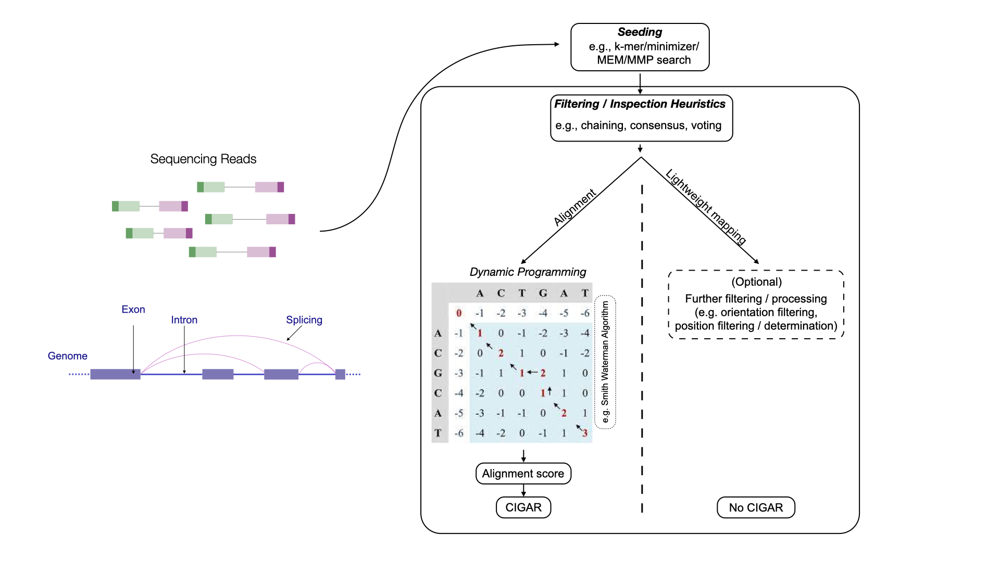

基于比对的方法和基于轻量级定位的方法的抽象概述。
:::

基于比对的方法可分为剪接比对和连续比对方法。

```{dropdown} 剪接比对方法
剪接比对方法允许一条读段序列跨越参考序列的多个不同区段进行比对，允许比对区域之间存在潜在的大间隔。
这些方法对于将 RNA-seq 读段比对到基因组特别有用，因为读段可能跨越 {term}`splice junctions <Splice Junctions>`。
在这种情况下，读段中的连续序列可能在参考序列中被内含子和外显子子序列分隔，可能跨越数千碱基的序列。
当读段只有一小部分跨越剪接点时，剪接比对特别具有挑战性，因为可用的序列信息有限，无法准确放置悬垂的片段。
```

```{dropdown} 连续比对方法
连续比对方法要求参考序列的一个连续子串与读段良好比对。
虽然可以容忍小的插入和缺失，但通常不允许大间隔——例如剪接比对中的间隔。
```

基于比对的方法（如剪接比对和连续比对）可以与**轻量级定位方法**区分开来，后者包括**伪比对** {cite}`Bray2016`、**准比对** {cite}`srivastava2016rapmap` 和**带结构约束的伪比对** {cite}`raw:He2022` 等方法。

轻量级定位方法可以实现显著更高的速度。
但是，它们不提供易于解释的基于分数的评估来确定匹配的质量，从而使得评估比对置信度更加困难。

(raw-proc:mapping-references)=

### 针对不同参考序列的比对

除了选择比对算法之外，_还_可以对读段所比对到的参考序列做出选择。
参考序列主要有三类：

- 完整的参考基因组（通常带注释）
- 带注释的转录组
- 增强转录组

目前，并非所有比对算法和参考序列的组合都是可能的。
例如，轻量级定位算法尚不支持针对参考基因组的读段剪接比对。

(raw-proc:genome-mapping)=

#### 比对到完整基因组

用于比对的第一种参考类型是目标生物体的**完整基因组**，通常在比对过程中考虑带注释的转录本。
`zUMIs` {cite}`zumis`、`Cell Ranger` {cite}`raw:Zheng2017` 和 `STARsolo` {cite}`Kaminow2021` 等工具遵循此方法。
由于许多读段源自**剪接转录本**，因此该方法需要一种**剪接感知比对算法**，能够在一个或多个剪接点之间拆分比对。

此方法的一个关键优势在于，它可以解释来自基因组中任何位置的读段，而不仅仅是来自带注释转录本的读段。
此外，由于构建了**全基因组索引**，不仅报告比对到已知剪接转录本的读段，还报告那些重叠内含子或在非编码区域内比对的读段，这使得该方法对**单细胞**和**单核**数据同样有效。
另一个好处是，即使是注释转录本、外显子或内含子之外比对的读段也可以被计入，从而实现量化基因座的**_事后_增强**。

(raw-proc:txome-mapping)=

#### 比对到剪接转录组

为了减少基因组剪接比对的计算开销，一种广泛采用的替代方法是仅使用带注释的转录本序列作为参考。
由于大多数单细胞实验是在小鼠或人类等模型生物上进行的——这些生物具有注释良好的转录组——基于转录组的定量可以实现与基于基因组的方法相似的读段覆盖率。

与基因组相比，转录组序列要小得多，显著减少了比对所需的计算资源。
此外，由于剪接模式已在转录本序列中体现，这种方法无需复杂的剪接比对。
相反，可以简单地搜索读段的连续比对或定位。
或者，可以使用连续比对来定位读段，使得基于比对和轻量级定位技术都适用于转录组参考。

虽然这些方法显着减少了比对和定位所需的内存和时间，但它们无法捕获来自剪接转录组外部的读段。
因此，它们不适合处理单核数据。
即使在单细胞实验中，来自剪接转录组外部的读段也可能构成所有数据的很大一部分，并且越来越多的证据表明此类读段应纳入后续分析 {cite}`technote_10x_intronic_reads,Pool2022`。
此外，当与轻量级定位方法配合使用时，剪接转录组与生成读段的实际基因组区域之间共享的短序列可能导致虚假定位。
反过来，这可能导致误导性甚至在生物学上不可信的基因表达估计 {cite}`Kaminow2021,Bruning2022Comparative,raw:He2022`。

(raw-proc:aug-txome-mapping)=

#### 比对到增强转录组

为了解释源自剪接转录本外部的读段，可以用额外的参考序列来增强剪接转录本序列，例如全长未剪接转录本或切除的内含子序列。
与全基因组比对相比，这可以实现更好、更快、更节省内存的定位，同时仍然捕获许多否则会丢失的读段。
与仅使用剪接转录组相比，可以可靠地分配更多读段，并且与轻量级定位方法结合使用时，可以显着减少虚假定位 {cite}`raw:He2022`。
增强转录组广泛用于不对全基因组进行比对的方法，特别是对于单核数据处理和 {term}`RNA velocity` 分析 {cite}`Soneson2021Preprocessing`（参见 {doc}`../trajectories/rna_velocity`）。
这些增强参考序列可以为所有不依赖全基因组剪接比对的常用方法构建 {cite}`Srivastava2019,Melsted2021,raw:He2022`。

(raw-proc:cb-correction)=

## 细胞条形码校正

基于液滴的单细胞分离系统，例如 10x Genomics 提供的系统，已成为研究细胞异质性的原因和后果的重要工具。
在此分离系统中，每个捕获细胞的 RNA 材料与**条形码微珠**一起在水基液滴封装中被提取。
这些微珠用独特的寡核苷酸（称为细胞条形码 (CB)）标记单个细胞的 RNA 内容，随后与从 RNA 内容逆转录的 cDNA 片段一起进行测序。
这些微珠包含高多样性的 DNA 条形码，允许对细胞的分子内容进行并行条形码标记，并通过计算机方式将测序读段解复用到各个细胞容器中。

```{admonition} 关于比对方向的说明

根据样本化学方法和用户定义的处理选项，并非所有比对到参考序列的测序片段都会用于定量和条形码校正。
一个常用的过滤标准是比对方向。
具体而言，某些化学方法规定了实验方案，使得比对的读段只能以特定方向来源于（即比对回）底层的转录本。
例如，在 10x Genomics 3' Chromium 化学方法中，我们期望生物学读段比对到底层转录本的正向链上，尽管反义读段确实存在 {cite}`technote_10x_intronic_reads`。
因此，以反向互补方向比对到参考序列的读段可能根据用户定义的设置被忽略或过滤。
如果某种化学方法遵循这种所谓的"链特异性"实验方案，应进行文档记录。
```

### 条形码错误的类型

用于单细胞实验的标签、序列和解复用方法总体上是有效的。
然而，在基于液滴的文库中，观察到的细胞条形码 (CB) 数量可能与原始封装的细胞数量存在显著差异——通常相差数倍。
这种差异源自几个关键的错误来源：

- 双联体/多联体：单个条形码可能与多个细胞关联，导致细胞计数不足。
- 空液滴：一些液滴中不包含封装细胞，环境 RNA 可能被条形码标记并测序，导致细胞计数过多。
- 序列错误：PCR 扩增或测序过程中引入的错误可能扭曲条形码计数，导致计数不足和过度。

为了解决这些问题，用于将 RNA-seq 读段解复用到细胞特异性容器中的计算工具使用各种诊断指标来过滤掉伪影或低质量数据。
已有多种方法用于去除环境 RNA 污染 {cite}`raw:Young2020,Muskovic2021,Lun2019`、检测双联体 {cite}`DePasquale2019,McGinnis2019,Wolock2019,Bais2019`，以及根据核苷酸序列相似性校正细胞条形码错误。

细胞条形码识别和校正采用以下几种常用策略。

1. **对照已知的_潜在_条形码列表进行校正**：
   某些化学方法（如 10x Chromium）从已知的潜在条形码序列池中抽取 CB。
   因此，在任何样本中观察到的条形码集都预期是该已知列表的子集，通常称为"白名单"。
   在这种情况下，标准方法假设：

   - 任何与已知列表中条目匹配的条形码都是正确的。
   - 对于不在列表中的任何条形码，通过从许可列表中查找最接近的匹配来校正，通常使用 {term}`Hamming distance` 或 {term}`edit distance`。
   这种策略可以实现高效的条形码校正，但也有局限性。
   如果损坏的条形码与许可列表中多个条形码非常相似，其校正就变得模糊不清。
   例如，对于取自 [10x Chromium v3 许可列表](https://teichlab.github.io/scg_lib_structs/data/10X-Genomics/3M-february-2018.txt.gz) 并在单个位置突变后不在列表中的条形码，其与许可列表中两个或更多条形码的汉明距离为 $1$ 的概率约为 $\sim 81\%$。
   可以通过考虑仅针对已知许可列表中_在给定样本中确实出现_的条形码进行校正（甚至仅针对在给定样本中出现且高于某个标称频率阈值的条形码）来降低此类冲突的概率。
   此外，诸如"校正"位置处的碱基质量等信息可以用于在模糊校正的情况下打破平局。
   然而，随着检测细胞数量的增加，潜在细胞条形码集合中序列多样性的不足会增加模糊校正的频率，而带有模糊校正条形码标签的读段通常被丢弃。

2. **基于拐点的方法**：
   如果潜在条形码集合未知——或者即使已知，但希望直接从观测数据本身进行校正而不依赖外部列表——可以使用基于这样观察的方法：高质量条形码是样本中关联读段数最多的那些。
   为实现这一目标，可以构建累计频率图，其中条形码按与其关联的不同读段或 UMI 的数量降序排列。
   通常，这种排序后的累计频率图会包含一个"拐点"——一个拐点拐点，可用于将频繁出现的条形码与不常见（因此很可能是错误的）条形码区分开来。
   已有多种方法试图识别这样的拐点 {cite}`Smith2017,Lun2019,raw:He2022`，作为正确捕获的细胞与空液滴之间可能的区分点。
   随后，出现在拐点"上方"的条形码集可被视为许可列表，其余条形码可对照该列表进行校正，如第一种方法所述。
   这种方法灵活，可应用于有外部许可列表和没有外部许可列表的化学方法。
   拐点查找算法的参数可以调整以产生更严格或更宽松的选定条形码集合。
   然而，这种方法也有一些缺点，例如倾向于过于保守，有时在不存在明显拐点的样本中无法稳健运行。

3. **基于预期细胞计数进行过滤和校正**：
   当条形码频率分布缺乏清晰的拐点或由于技术伪影而显示双峰模式时，可以通过用户提供的预期细胞计数来指导条形码校正。
   在此方法中，用户提供对检测细胞预期数量的估计。
   然后，条形码按频率降序排列，获取接近预期细胞计数的稳健分位数索引处的频率 $f$，并将频率在 $f$ 的小常数倍数范围内（例如 $\ge \frac{f}{10}$）的所有细胞视为有效条形码。
   再次，剩余的条形码通过尝试基于序列相似性唯一地校正到这些有效条形码之一来对照该有效列表进行校正。

4. **基于强制有效细胞数量进行过滤**：
   最简单的方法——尽管可能存在问题——是用户手动指定有效条形码的数量。

   - 用户在排序后的条形码频率列表中选择一个索引。
   - 高于此阈值的所有条形码被视为有效。
   - 剩余的条形码使用标准的基于相似性的校正方法对照此列表进行校正。
   虽然这保证了至少选择 n 个细胞，但它假设所选择的阈值准确地反映了真实细胞的数量。
   仅当用户有充分理由相信阈值频率应设置在所提供的索引附近时，这才是合理的。

(raw-proc:umi-resolution)=

## UMI 解析

细胞条形码 (CB) 校正后，读段要么被丢弃，要么分配给校正后的 CB。
随后，我们希望量化每个校正 CB 中每个基因的丰度。

由于 {ref}`exp-data:transcript-quantification` 中讨论的 {term}`amplification bias`，必须基于 UMI 对读段进行去重，以评估采样分子的真实计数 ({numref}`umi-figure`)。此外，在尝试执行此估计时，还面临若干其他复杂因素的挑战。

UMI 去重步骤旨在识别实验中每个捕获并测序的细胞中，源自每个原始（PCR 前）分子的读段和 UMI 集合。
此过程的结果是为每个细胞中每个基因分配一个分子计数，随后在下游分析中用作该基因的原始表达估计值。
我们将查看观测到的 UMI 集合及其关联的比对读段并尝试推断每个基因产生的原始观测分子数量的过程称为_UMI 解析_。

为简化说明，将比对到某个参考序列（如基因的基因组位点）的读段称为该参考序列的读段，其 UMI 标签称为该参考序列的 UMI。
与特定 UMI 关联的读段集称为该 UMI 的读段。

一条读段只能被一个 UMI 标记，但如果它比对到多个参考序列，则可能属于多个参考序列。
此外，由于 scRNA-seq 中的分子条形码通常在每个细胞中是隔离且独立的（除了前面讨论的细胞条形码解析挑战外），_UMI 解析_将针对单个细胞进行说明，这不失一般性。
相同的过程通常独立应用于所有细胞。

```{figure} ../_static/images/raw_data_processing/UMI.png
:name: umi-figure
:alt: Figure UMIs
:with: 100%


UMI 通过追踪原始分子来减少 PCR 扩增偏差，但可能受到不同类型错误（蓝色框）的影响。
UMI 标签中的核苷酸替换可能在扩增或测序过程中发生。
多重比对可能发生在共享相同 UMI 的读段比对到不同基因时（蓝色和红色），单条读段比对到多个基因时（灰色），或两者兼有时。
```

(raw-proc:need-for-umi-resolution)=

### UMI 解析的必要性

在理想情况下，正确（未改变）的 UMI 标记读段，每个 UMI 的读段唯一地比对到一个共同的参考基因，且 UMI 与 PCR 前分子之间存在一一对应关系。
因此，UMI 去重过程在概念上很简单：一个 UMI 的读段是来自单个 PCR 前分子的 PCR 重复。
每个基因被捕获和测序的分子数即该基因观测到的不同 UMI 的数量。

然而，实践中遇到的问题使得上述简单规则不足以普遍识别 UMI 的基因来源，需要开发更复杂的模型 ({numref}`umi-figure`)：

- **UMI 中的错误**：
  当读段的测序 UMI 标签包含 PCR 或测序过程中引入的错误时会发生。
  常见的 UMI 错误包括 PCR 期间的核苷酸替换和测序期间的读段错误。
  如果未能解决此类 UMI 错误，可能会夸大估计的分子数量 {cite}`Smith2017,ziegenhain2022molecular`。

- **多重比对**：
  当读段或 UMI 属于多个参考序列（如多基因读段/UMI）时会出现此问题。
  当 UMI 的不同读段比对到不同基因时、当一条读段比对到多个基因时，或两者兼有时，会发生这种情况。
  此问题的后果是多基因读段/UMI 的基因来源不明确，导致这些基因的采样 PCR 前分子计数存在不确定性。
  简单地丢弃多基因读段/UMI 可能导致数据丢失或倾向于产生多重比对读段的基因之间的偏差估计，例如序列相似的基因家族 {cite}`Srivastava2019`。

```{admonition} 关于 UMI 错误的说明
UMI 错误，尤其是核苷酸替换和错误检出导致的错误，在单细胞实验中普遍存在。
{cite:t}`Smith2017` 证实，被测单细胞实验中观测到的 UMI 序列之间的平均碱基差异数（编辑距离）低于随机采样的 UMI 序列，且低编辑距离的富集与 PCR 扩增程度高度相关。
多重比对也存在于单细胞数据中，并且根据所考虑的基因不同，可能以不可忽略的比率发生。
{cite:t}`Srivastava2019` 表明，丢弃多重比对读段可能会对预测的分子计数产生负偏差。
```

还存在其他我们在此未重点关注的挑战，例如"趋同"和"发散"UMI 碰撞。
我们将同一细胞中同一基因产生的两个不同 PCR 前分子被相同 UMI 标记的情况视为趋同碰撞。
当两个或多个不同的 UMI 源自同一个 PCR 前分子时（例如，由于该分子的多个引物位点被采样），我们将其视为发散碰撞。
我们预期趋同 UMI 碰撞很少见，因此其影响通常很小。
此外，转录本级别的比对信息有时可用于解决此类碰撞 {cite}`Srivastava2019`。
发散 UMI 碰撞主要发生在未剪接转录本的内含子中 {cite}`technote_10x_intronic_reads`，解决这些问题的方法是一个活跃的研究领域 {cite}`technote_10x_intronic_reads,Gorin2021`。

鉴于 UMI 在高通量 scRNA-seq 实验方案中几乎无处不在的使用，以及解决这些错误能改善基因丰度估计的事实，近年来的文献对 UMI 解析问题给予了大量关注 {cite}`Islam2013,Bose2015,raw:Macosko2015,Smith2017,Srivastava2019,Kaminow2021,Melsted2021,raw:He2022,calib,umic,zumis`。

```{dropdown} 基于图的 UMI 解析

(raw-proc:graph-based-umi-resolution)=

### 基于图的 UMI 解析

由于在尝试解析 UMI 时出现的各种问题，已经开发了许多方法来解决 UMI 解析问题。
虽然有多种不同的 UMI 解析方法，我们将重点讨论一种表示问题实例的框架，该框架基于 {cite:t}`Smith2017` 最初提出的框架进行修改，依赖于_UMI 图_的概念。
此图的每个连通分量代表一个子问题，其中某些 UMI 子集被折叠（即，被解析为同一 PCR 前分子的证据）。
许多流行的 UMI 解析方法可以在该框架中解释，只需精确修改图的构建方式以及图上折叠或解析过程的执行方式。

在单细胞数据的上下文中，UMI 图 $G(V,E)$ 是一个 {term}`directed graph`，具有节点集 $V$ 和边集 $E$。
每个节点 $v_i \in V$ 代表读段的一个等价类 (EC)，边集 $E$ 编码 EC 之间的关系。
定义在读段上的等价关系 $\sim_r$ 基于其 UMI 和比对信息。
我们说读段 $r_x$ 和 $r_y$ 等价，即 $r_x \sim_r r_y$，当且仅当它们具有相同的 UMI 标签并比对到相同的参考序列集。
UMI 解析方法可将"参考序列"定义为基因组位点 {cite}`Smith2017`、转录本 {cite}`Srivastava2019,raw:He2022` 或基因 {cite}`raw:Zheng2017,Kaminow2021`。

在 UMI 图框架中，UMI 解析方法可分为三个主要步骤：
**定义节点**、**定义邻接关系**和**解析分量**。
每个步骤都有不同的选项，可由不同方法模块化组合。
此外，这些步骤有时可能在之前（和/或之后）伴随过滤步骤，旨在丢弃或启发式地分配（通过修改报告的参考序列比对集）表现出特定类型比对模糊性的读段和 UMI。

(raw-proc:umi-graph-node-def)=

#### 定义节点

如上所述，节点 $v_i \in V$ 是读段的一个等价类。
因此，$V$ 可以基于全部或过滤后的比对读段集及其关联的_未校正_ UMI 来定义。
所有满足等价关系 $\sim_r$（基于其参考序列集和 UMI 标签）的读段都与同一个顶点 $v \in V$ 关联。
如果一个 EC 的 UMI 是多基因 UMI，则该 EC 是多基因 EC。
某些方法通过过滤或在节点创建之前启发式地分配读段来避免创建此类 EC，而其他方法则保留并处理这些模糊顶点，并尝试通过简约性、概率分配或基于相关规则或模型来解析其基因来源 {cite}`Srivastava2019,Kaminow2021,raw:He2022`。

(raw-proc:umi-graph-edge-def)=

#### 定义邻接关系

创建 UMI 图的节点集 $V$ 后，$V$ 中节点的邻接关系基于其 UMI 序列之间的距离（通常是汉明距离或编辑距离）以及可选的关联参考序列集的内容来定义。

在此我们定义节点 $v_i \in V$ 上的以下函数：

- $u(v_i)$ 是 $v_i$ 的 UMI 标签。
- $c(v_i) = |v_i|$ 是 $v_i$ 的基数，即关联到 $v_i$ 的满足 $\sim_r$ 的读段数量。
- $m(v_i)$ 是 $v_i$ 的比对信息中编码的参考序列集。
- $D(v_i, v_j)$ 是 $u(v_i)$ 和 $u(v_j)$ 之间的距离，其中 $v_j \in V$。

给定这些函数定义，任意两个节点 $v_i, v_j \in V$ 将通过一条双向边相连，当且仅当 $m(v_i) \cap m(v_j) \ne \emptyset$ 且 $D(v_i,v_j) \le \theta$，其中 $\theta$ 是距离阈值，通常设为 $\theta=1$ {cite}`Smith2017,Kaminow2021,Srivastava2019`。
此外，如果 $c(v_i) \ge 2c(v_j) -1$ 或反之亦然，双向边可替换为从 $v_i$ 到 $v_j$ 的有向边 {cite}`Smith2017,Srivastava2019`。
虽然这些边定义是最常见的，但其他定义也是可能的，只要它们完全由 $u$、$c$、$m$ 和 $D$ 函数定义即可。有了 $V$ 和 $E$，UMI 图 $G = (V,E)$ 即被定义。

(raw-proc:umi-graph-resolution-def)=

#### 定义图解析方法

给定已定义的 UMI 图，可以应用多种不同的解析方法。
解析方法可以简单到寻找连通分量集、对图进行聚类、贪心地折叠节点或收缩边 {cite}`Smith2017`，或者搜索图被遵循特定规则的结构（如单色树状结构 {cite}`Srivastava2019`）覆盖来简化图。
最终，简化后的 UMI 图中的每个节点，或在图不被动态修改的情况下覆盖中的每个元素，代表一个 PCR 前分子。
折叠的节点或覆盖集被视为该分子的 PCR 重复。

用于定义邻接关系的不同规则和用于图解析本身的不同方法可以寻求保留不同的属性，并定义出各种不同的整体 UMI 解析方法。
对于概率性地解决多重比对引起模糊性的方法，解析后的 UMI 图可能包含多基因等价类 (EC)，其基因来源在下一步确定。

还存在其他 UMI 解析方法，例如无参考模型 {cite}`umic` 和矩量法 {cite}`Melsted2021`，但它们可能不容易在该框架中表示，在此不进一步讨论。

```

(raw-proc:umi-graph-quantification)=

#### 定量

UMI 解析的最后一步是使用解析后的 UMI 图定量每个基因的丰度。
对于丢弃多基因 EC 的方法，通过计数标记为每个基因的 EC 数量来生成当前处理细胞中基因的分子计数向量（简称计数向量）。
另一方面，处理（而非丢弃）多基因 EC 的方法通常通过应用某种统计推断过程来解析模糊性。
例如，{cite:t}`Srivastava2019` 引入了一种期望最大化 (EM) 方法用于概率性地分配多基因 UMI，相关的 EM 算法也已作为后续工具的可选步骤引入 {cite}`Melsted2021,Kaminow2021,raw:He2022`。
在此模型中，折叠后的 EC 到基因的分配是潜在变量，基因的去重分子计数是主要参数。
直观上，来自基因唯一 EC 的证据将被用于帮助概率性地分配多基因 EC。
EM 算法寻找共同具有生成观测 ECs 的（局部）最高似然性的参数。

通常，上述 UMI 解析和定量过程将针对每个细胞（由校正后的 CB 表示）单独执行，以创建所有细胞中所有基因的完整计数矩阵。
然而，高通量单细胞样本中每个细胞信息的相对匮乏限制了执行 UMI 解析时可用的证据，这反过来又限制了基于模型的解决方案（如上述统计推断过程）的潜在效力。

(raw-proc:count-qc)=

## 计数矩阵质量控制

生成计数矩阵后，执行质量控制 (QC) 评估非常重要。
有若干不同的评估通常属于质量控制的范畴。
通常会记录和报告基本的全局指标，以帮助评估测序测量本身的整体质量。
这些指标包括比对读段的总比例、每个细胞观测到的不同 UMI 的分布、UMI 去重率的分布、每个细胞检测到的基因数的分布等。
这些及类似的指标通常由定量工具本身记录 {cite}`raw:Zheng2017,Kaminow2021,Melsted2021,raw:He2022`，因为它们在读段比对、细胞条形码校正和 UMI 解析过程中自然产生并可以计算。
同样，存在若干工具帮助组织和可视化这些基本指标，如 [Loupe browser](https://support.10xgenomics.com/single-cell-gene-expression/software/visualization/latest/what-is-loupe-cell-browser)、[alevinQC](https://github.com/csoneson/alevinQC) 或 [kb_python report](https://github.com/pachterlab/kb_python)，取决于所使用的定量流程。
除了这些基本的全局指标之外，在此分析阶段，QC 指标主要旨在帮助确定哪些细胞 (CB) 已被"成功"测序，哪些表现出需要过滤或校正的伪影。

在以下折叠部分中，我们讨论一个示例 alevinQC 报告，取自 `alevinQC` [手册页面](https://github.com/csoneson/alevinQC)。

```{toggle}

一旦 `alevin` 或 `alevin-fry` 对单细胞数据进行定量，数据质量可以通过 R 包 [`alevinQC`](https://github.com/csoneson/alevinQC) 进行评估。
alevinQC 报告可以 PDF 格式或 R/Shiny 应用程序的形式生成，总结单细胞文库的各个组成部分，如读段、CB 和 UMI。

**1. 元数据和汇总表**

:::{figure-md} raw-proc-fig-alevinqc-summary
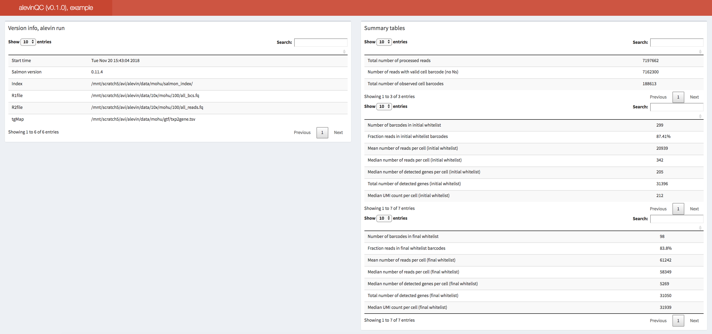

alevinQC 报告摘要部分的示例。
:::

alevinQC 报告的第一部分显示输入文件和处理结果的摘要，其中左上方的表格显示 `alevin`（或 `alevin-fry`）为定量结果提供的元数据。
例如，这包括运行时间、工具版本以及输入 FASTQ 和索引文件的路径。
右上方的汇总表提供了单细胞文库各个组成部分的汇总统计信息，例如测序读段数、不同过滤级别下选定的细胞条形码数量，以及去重 UMI 的总数。

**2. 拐点图，初始白名单确定**

:::{figure-md} raw-proc-fig-alevinqc-plots
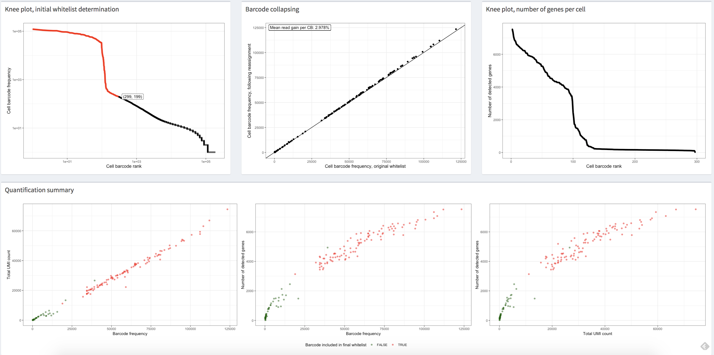

该图显示了一个示例单细胞数据集的 alevinQC 报告中的图表，其中的细胞使用"拐点"查找方法进行过滤。
每个点代表一个带有其校正轮廓的校正细胞条形码。
:::

{numref}`raw-proc-fig-alevinqc-plots` 中的第一个（左上）视图按降序显示细胞条形码频率的分布。
在上面显示的所有图中，每个点代表一个校正后的细胞条形码，其 x 坐标对应其细胞条形码频率排名。
在左上图中，y 坐标对应于校正条形码的观测频率。
通常，此图显示出"拐点"样模式，可用于识别初始高质量条形码列表。
图中的红点代表在应用基于"拐点"的过滤时被选为高质量细胞条形码的条形码。
换言之，这些细胞条形码包含足够数量的读段，可被视为高质量并很可能源自真实存在的细胞。
假设在 CB 校正步骤中传入了外部许可列表，这意味着没有使用内部算法来区分高质量细胞条形码。
在这种情况下，图中的所有点都将被标为红色，因为这些校正后的细胞条形码都在整个原始数据处理流程中被处理并报告在基因计数矩阵中。
如果所有细胞条形码的频率持续偏低，应对数据质量持怀疑态度。

**3. 条形码折叠**

在确定要处理的条形码后（无论是通过内部阈值（如基于"拐点"的方法）还是通过外部白名单），`alevin`（或 `alevin-fry`）执行细胞条形码序列校正。
条形码折叠图（{numref}`raw-proc-fig-alevinqc-plots` 中的上中图）显示了细胞条形码序列校正后与校正前分配到的读段数。
通常，我们会看到所有点都落在代表 $x = y$ 的线附近，这意味着 CB 校正中的重新分配通常不会显著改变细胞条形码的分布轮廓。

**4. 拐点图，每个细胞的基因数**

{numref}`raw-proc-fig-alevinqc-plots` 中的右上图显示所有处理的细胞条形码的观测基因数分布。
通常，每个细胞平均 $2,000$ 个基因被认为是中等但合理的水平，适合下游分析。
如果所有细胞的观测基因数都偏低，应仔细复核数据质量。

**5. 定量总结**

最后，一系列定量摘要图（{numref}`raw-proc-fig-alevinqc-plots` 中的底部图表）使用散点图比较细胞条形码频率、去重后的 UMI 总数以及非零基因总数。
总体而言，在每个图中，绘图数据应显示正相关性，如果执行了高质量过滤（如拐点过滤），高质量细胞条形码应与其余条形码明显分离。
此外，应期望所有三个图传达相似的趋势。
如果使用外部许可列表，图中的所有点都将被标为红色，因为所有这些细胞条形码都在基因计数矩阵中被处理和报告。
不过，我们仍应看到图之间的相关性以及代表高质量细胞的点与其他点的分离。
如果所有这些指标在细胞间持续偏低，或者这些图传达了显著不同的趋势，则应对数据质量感到担忧。

```

### 空液滴检测

第一个 QC 步骤之一是确定哪些细胞条形码对应"高置信度"的测序细胞。
在基于液滴的实验方案 {cite}`raw:Macosko2015` 中，某些条形码与周围环境中的 {term}`RNA` 相关联，而非捕获细胞的 RNA，这种情况很常见。
当液滴未能捕获细胞时，就会发生这种情况。
这些空液滴仍倾向于产生测序读段，尽管这些读段的特征与正确捕获细胞对应的条形码相关读段明显不同。
已有多种方法评估条形码是否可能对应空液滴。
一种简单的方法是检查条形码的累计频率图，其中条形码按与其关联的不同 UMI 数量降序排列。
此图通常包含一个"拐点"，可以被识别为正确捕获的细胞与空液滴之间可能的区分点 {cite}`Smith2017,raw:He2022`。
虽然这种"拐点"方法直观且通常可以估计出合理的阈值，但它有几个缺点。
例如，并非所有累计直方图都显示明显的拐点，而且众所周知，设计能够稳健且自动检测此类拐点的算法非常困难。
最后，与条形码关联的总 UMI 计数本身可能不是确定条形码是否与空细胞或受损细胞关联的最佳信号。

这催生了若干专门设计用于检测空液滴或受损液滴，或通常被认为"低质量"细胞的工具的研发 {cite}`Lun2019,Heiser2021,Hippen2021,Muskovic2021,Alvarez2020,raw:Young2020`。
这些工具结合了多种不同的细胞质量度量，包括不同 UMI 的频率、检测到的基因数以及线粒体 RNA 的比例，通常通过对这些特征应用统计模型来将高质量细胞与推定的空液滴或受损细胞分类。
这意味着细胞通常可以被评分，并可以基于估计的细胞非空或非受损的后验概率来选择最终过滤。
虽然这些模型通常适用于单细胞 {term}`RNA`-seq 数据，但可能需要应用若干额外过滤器或启发式方法来在单核 {term}`RNA`-seq 数据中获得稳健过滤 {cite}`Kaminow2021,raw:He2022`，如 `DropletUtils` {cite}`Lun2019` 的 [`emptyDropsCellRanger`](https://github.com/MarioniLab/DropletUtils/blob/master/R/emptyDropsCellRanger.R) 函数中公开的那些。

### 双联体检测

除了确定哪些细胞条形码对应空液滴或受损细胞外，人们可能还希望识别那些对应双联体或多联体的细胞条形码。
当给定液滴捕获两个（双联体）或更多（多联体）细胞时，可能导致这些细胞条形码在读段数和 UMI 数等数量以及基因表达谱方面呈现偏态分布。
也已开发了许多工具来预测细胞条形码的双联体状态 {cite}`DePasquale2019,McGinnis2019,Wolock2019,Bais2019,Bernstein2020`。
一旦被检测到，被确定为可能是双联体和多联体的细胞可以被移除或在后续分析中以其他方式调整。

(raw-proc:output-representation)=

## 计数数据表示

当完成初始原始数据处理和质量控制并进入后续分析时，重要的是要认识到并记住，细胞×基因计数矩阵至多只是原始样本中测序分子的近似值。
在原始数据处理流程的多个阶段，应用了启发式方法并进行了简化以生成此计数矩阵。
例如，读段比对是不完美的，细胞条形码校正也是如此。
准确解析 UMI 尤其具有挑战性，与附加到多重比对读段的 UMI 相关的问题经常被忽视。
此外，多个引物位点（尤其是在未剪接分子中）可能违反通常假设的一分子一对一 UMI 关系。

## 简要讨论

为结束本章，我们传达一些来自最近围绕上述一些常见预处理工具的基准测试和综述研究的观察结果和建议 {cite}`You_2021,Bruning_2022`。
当然，需要注意的是，单细胞和单核 RNA-seq 原始数据处理的方法和工具的开发，以及对此类方法的持续评估，是社区持续努力的结果。
因此，在进行分析时，尝试几种不同的工具通常是有用且合理的。

在最粗略的层面上，最常见的工具可以稳健且准确地处理数据。
有人建议，对于许多常见的下游分析（如聚类）及其所使用的方法，预处理工具的选择通常比分析过程中的其他步骤产生更小的差异 {cite}`You_2021`。
尽管如此，也有人观察到，应用仅限于剪接转录组的轻量级定位可能增加虚假比对和基因表达估计的概率 {cite}`Bruning_2022`。

最终，特定工具的选择在很大程度上取决于手头的任务以及可用计算资源的限制。
如果执行标准的单细胞分析，基于轻量级定位的方法是不错的选择，因为它们比现有的基于比对的工具更快（通常快得多）且更节省内存。
如果执行单核 RNA-seq 分析，`alevin-fry` 是一个特别有吸引力的选择，因为它保持内存节约且即使转录组参考扩展到包含未剪接的参考序列，其索引仍然相对较小。
另一方面，当恢复（扩展）转录组之外比对的读段很重要，或下游分析需要基因组比对位置时，建议使用基于比对的方法。
这对于使用 `sierra` {cite}`sierra` 等工具进行差异转录本使用分析等任务尤为相关。
在基于比对的流程中，根据 {cite:t}`Bruning_2022`，`STARsolo` 应优先于 `Cell Ranger`，因为前者比后者快得多且需要更少的内存，同时能够产生几乎相同的结果。

(raw-proc:example-workflow)=

## 一个真实示例

鉴于我们已经涵盖了各种原始数据处理方法背后的概念，现在将注意力转向演示如何使用特定工具（本例中为 `alevin-fry`）处理一个小型示例数据集。
首先，我们需要单细胞实验的测序读段（[FASTQ 格式](https://en.wikipedia.org/wiki/FASTQ_format)）和读段将比对到的参考序列（如转录组）。
通常，参考序列包括被测序物种的基因组序列和相应的基因注释，分别为 [FASTA](https://en.wikipedia.org/wiki/FASTA_format) 和 [GTF](https://useast.ensembl.org/info/website/upload/gff.html) 格式。

在此示例中，我们将使用人类基因组的_第 5 号染色体_及其相关基因注释作为参考序列，这是来自 10x Genomics 参考构建的人类参考 [GRCh38 (GENCODE v32/Ensembl 98)](https://support.10xgenomics.com/single-cell-gene-expression/software/release-notes/build#GRCh38_2020A) 的子集。
相应地，我们从 10x Genomics 的[人类脑肿瘤数据集](https://www.10xgenomics.com/resources/datasets/200-sorted-cells-from-human-glioblastoma-multiforme-3-lt-v-3-1-3-1-low-6-0-0)中提取比对到所生成参考序列的读段子集。

[`Alevin-fry`](https://alevin-fry.readthedocs.io/en/latest/) {cite}`raw:He2022` 是一种快速、准确且节省内存的单细胞和单核数据处理工具。
[Simpleaf](https://github.com/COMBINE-lab/simpleaf) 是一个用 [Rust](https://www.rust-lang.org/) 编写的程序，它提供了一个统一且简化的接口，用于使用 `alevin-fry` 流程处理一些最常见的实验方案和数据类型。
还存在一个基于 Nextflow 的[工作流](https://github.com/COMBINE-lab/quantaf)工具，用于处理大量单细胞数据集合。
这里我们将首先展示如何使用两个 `simpleaf` 命令处理单细胞原始数据。然后，我们描述与这些 `simpleaf` 命令对应的完整 `salmon alevin` 和 `alevin-fry` 命令集，以概述本节所述步骤发生的位置并传达可能的不同处理选项。
这些命令将从命令行运行，[`conda`](https://docs.conda.io/en/latest/) 将用于安装运行此示例所需的所有软件。

(raw-proc:example-prep)=

### 准备工作

开始之前，我们在终端中创建一个 conda 环境并安装所需的包。
`Simpleaf` 依赖 [`alevin-fry`](https://alevin-fry.readthedocs.io/en/latest/)、[`salmon`](https://salmon.readthedocs.io/en/latest/) 和 [`pyroe`](https://github.com/COMBINE-lab/pyroe)。
它们均可在 `bioconda` 上获取，在安装 `simpleaf` 时会自动安装。

```bash
conda create -n af -y -c bioconda simpleaf
conda activate af
```

````{admonition} 关于使用 Apple Silicon 设备的注意事项

Conda 目前不原生支持为 Apple Silicon 构建大多数包。
因此，如果您使用的是非 Intel 的 Apple 计算机（例如配备 M1 (Pro/Max/Ultra) 或 M2 芯片），
您应确保指定环境使用 Rosetta2 翻译层。
为此，您可以将上述命令替换为以下命令（说明来自
[此处](https://github.com/Haydnspass/miniforge#rosetta-on-mac-with-apple-silicon-hardware)）：

```bash
CONDA_SUBDIR=osx-64 conda create -n af -y -c bioconda simpleaf   # 创建新环境
conda activate af
conda env config vars set CONDA_SUBDIR=osx-64  # 后续命令使用 Intel 包
```
````

接下来，我们创建一个工作目录 `af_xmpl_run`，并从远程主机下载和解压缩示例数据集。

```bash
# 创建工作目录并进入该工作目录
## && 操作符帮助用一行代码执行两个命令。
mkdir af_xmpl_run && cd af_xmpl_run

# 获取示例数据集和 CB 许可列表并解压
## 管道操作符 (|) 将 wget 命令的输出传递给 tar 命令。
## `tar xzf` 后的破折号操作符 (-) 捕获第一个命令的输出。
## - 示例数据集
wget -qO- https://umd.box.com/shared/static/lx2xownlrhz3us8496tyu9c4dgade814.gz | tar xzf - --strip-components=1 -C .
## 获取的包含 fastq 文件的文件夹名为 toy_read_fastq。
fastq_dir="toy_read_fastq"
## 获取的包含人类参考文件的文件夹名为 toy_human_ref。
ref_dir="toy_human_ref"

# 获取 CB 许可列表
## 右尖括号 (>) 将 STDOUT 重定向到文件。
wget -qO- https://github.com/f0t1h/3M-february-2018/raw/master/3M-february-2018.txt.gz | gunzip - > 3M-february-2018.txt

```

参考文件（基因组 FASTA 文件和基因注释 GTF 文件）和读段记录（FASTQ 文件）准备就绪后，我们现在可以应用上述原始数据处理流程来生成基因计数矩阵。

(raw-proc:example-simpleaf)=

### 简化的原始数据处理流程

[Simpleaf](https://github.com/COMBINE-lab/simpleaf) 旨在简化单细胞和单核原始数据处理的 `alevin-fry` 接口。它将整个处理流程封装为两个步骤：

1. [`simpleaf index`](https://simpleaf.readthedocs.io/en/latest/index-command.html) 为提供的参考序列构建索引，或制作 _splici_ 参考序列（<u>splic</u>ed transcripts + <u>i</u>ntrons）并为其构建索引。
2. [`simpleaf quant`](https://simpleaf.readthedocs.io/en/latest/quant-command.html) 将测序读段比对到索引参考序列，并对比对记录进行定量以生成基因计数矩阵。

有关使用 `simpleaf` 进行比对的更多高级用法和选项，可参见[此处](https://simpleaf.readthedocs.io/en/latest/)。

运行 `simpleaf index` 时，如果提供了基因组 FASTA 文件 (`-f`) 和基因注释 GTF 文件 (`-g`)，它将生成 _splici_ 参考序列并为其构建索引；如果只提供转录组 FASTA 文件 (`--refseq`)，它将直接为其构建索引。目前，我们推荐使用 _splici_ 索引。

```bash
# simpleaf 需要环境变量 ALEVIN_FRY_HOME 来存储配置和数据。
# 例如，它使用的底层程序的路径和 CB 许可列表
mkdir alevin_fry_home && export ALEVIN_FRY_HOME='alevin_fry_home'

# simpleaf set-paths 命令查找所需工具的路径，并在 ALEVIN_FRY_HOME 文件夹中写入一个配置 JSON 文件。
simpleaf set-paths

# simpleaf index
# 用法: simpleaf index -o out_dir [-f genome_fasta -g gene_annotation_GTF|--refseq transcriptome_fasta] -r read_length -t number_of_threads
## -r read_length 是测序仪生成生物学读段（Illumina 中的 read 2）所执行的测序循环数。
## 公开可用数据集通常在描述中包含读段长度。有时它们被称为循环数。
simpleaf index \
-o simpleaf_index \
-f toy_human_ref/fasta/genome.fa \
-g toy_human_ref/genes/genes.gtf \
-r 90 \
-t 8
```

在输出目录 `simpleaf_index` 中，`ref` 文件夹包含 _splici_ 参考序列；`index` 文件夹包含基于 _splici_ 参考序列构建的 salmon 索引。

下一步，`simpleaf quant` 读取索引目录和比对记录 FASTQ 文件以生成基因计数矩阵。此命令封装了本节讨论的所有主要步骤，包括比对、细胞条形码校正和 UMI 解析。

```bash
# 收集测序读段文件
## reads1 和 reads2 变量通过从 toy_read_fastq 目录中查找具有模式 "_R1_" 和 "_R2_" 的文件名来定义。
reads1_pat="_R1_"
reads2_pat="_R2_"

## 读段文件必须排序并用逗号分隔。
### find 命令在 fastq_dir 中查找具有名称模式的文件
### sort 命令对文件名进行排序
### awk 命令和 paste 命令一起将文件名转换为逗号分隔的字符串。
reads1="$(find -L ${fastq_dir} -name "*$reads1_pat*" -type f | sort | awk -v OFS=, '{$1=$1;print}' | paste -sd,)"
reads2="$(find -L ${fastq_dir} -name "*$reads2_pat*" -type f | sort | awk -v OFS=, '{$1=$1;print}' | paste -sd,)"

# simpleaf quant
## 用法: simpleaf quant -c chemistry -t threads -1 reads1 -2 reads2 -i index -u [unspliced permit list] -r resolution -m t2g_3col -o output_dir
simpleaf quant \
-c 10xv3 -t 8 \
-1 $reads1 -2 $reads2 \
-i simpleaf_index/index \
-u -r cr-like \
-m simpleaf_index/index/t2g_3col.tsv \
-o simpleaf_quant
```

运行这些命令后，得到的定量信息可以在 `simpleaf_quant/af_quant/alevin` 文件夹中找到。
在此目录中，有三个文件：`quants_mat.mtx`、`quants_mat_cols.txt` 和 `quants_mat_rows.txt`，分别对应计数矩阵、该矩阵每列的基因名称，以及该矩阵每行的校正后、过滤后的细胞条形码。这些文件的尾部行如下所示。
这里值得注意的是，`alevin-fry` 以 USA 模式（<u>u</u>nspliced、<u>s</u>pliced 和 <u>a</u>mbiguous 模式）运行，因此对每个基因的剪接和未剪接状态都进行了定量——生成的 `quants_mat_cols.txt` 文件的行数将等于注释基因数的 3 倍，分别对应每个基因的剪接 (S)、未剪接 (U) 和剪接模糊 (A) 变体所使用的名称。

```bash
# `quants_mat.mtx` 中的每行表示
# 格式为 行 列 条目 的一个非零条目
$ tail -3 simpleaf_quant/af_quant/alevin/quants_mat.mtx
138 58 1
139 9 1
139 37 1

# `quants_mat_cols.txt` 中的每行是一个基因的
# 剪接状态，格式为 (基因名)-(剪接状态)
$ tail -3 simpleaf_quant/af_quant/alevin/quants_mat_cols.txt
ENSG00000120705-A
ENSG00000198961-A
ENSG00000245526-A

# `quants_mat_rows.txt` 中的每行是一个校正后
# （且可能经过过滤的）细胞条形码
$ tail -3 simpleaf_quant/af_quant/alevin/quants_mat_rows.txt
TTCGATTTCTGAATCG
TGCTCGTGTTCGAAGG
ACTGTGAAGAAATTGC
```

我们可以使用 [`pyroe`](https://github.com/COMBINE-lab/pyroe) 中的 `load_fry` 函数将计数矩阵加载到 Python 中作为 [`AnnData`](https://anndata.readthedocs.io/en/latest/) 对象。
类似的函数 [loadFry](https://rdrr.io/github/mikelove/fishpond/man/loadFry.html) 也已在 [`fishpond`](https://github.com/mikelove/fishpond) R 包中实现。

```python
import pyroe

quant_dir = 'simpleaf_quant/af_quant'
adata_sa = pyroe.load_fry(quant_dir)
```

默认行为将 `AnnData` 对象的 `X` 层加载为每个基因的剪接计数和模糊计数的总和。
然而，最近的工作 {cite}`Pool2022` 和[更新的实践](https://support.10xgenomics.com/single-cell-gene-expression/software/pipelines/latest/release-notes)建议，即使在单细胞 RNA-seq 数据中包含内含子计数也可能提高灵敏度并有益于下游分析。
虽然利用这些信息的最佳方式仍在研究中，但由于 `alevin-fry` 自动定量每个样本中的剪接、未剪接和模糊读段，包含每个基因总计数的计数矩阵可以如下简单地获得：

```python
import pyroe

quant_dir = 'simpleaf_quant/af_quant'
adata_usa = pyroe.load_fry(quant_dir, output_format={'X' : ['U','S','A']})
```

(raw-proc:example-map)=

### 完整的 alevin-fry 流程

`Simpleaf` 使得用几个命令就能以"标准"方式处理单细胞原始数据成为可能。
接下来，我们将展示如何通过显式调用 `pyroe`、`salmon` 和 `alevin-fry` 命令来生成完全相同的定量结果。
除了教学价值外，了解每个步骤的确切命令在只需要重新运行流程的一部分，或需要指定 `simpleaf` 当前未暴露的某些参数时会很有帮助。

请注意，{ref}`raw-proc:example-prep` 部分中的命令应提前执行。
以下命令中调用的所有工具——`pyroe`、`salmon` 和 `alevin-fry`——在安装 `simpleaf` 时已经安装。

#### 构建索引

首先，我们处理基因组 FASTA 文件和基因注释 GTF 文件以获得 _splici_ 索引。
下面代码块中的命令与上述 `simpleaf index` 命令类似。这包括两个步骤：

1. 通过调用 `pyroe make-splici`，使用基因组和基因注释文件构建 _splici_ 参考序列（<u>splic</u>ed transcripts + <u>i</u>ntrons）
2. 通过调用 `salmon index` 为 _splici_ 参考序列构建索引

```bash
# 制作 splici 参考序列
## 用法: pyroe make-splici genome_file gtf_file read_length out_dir
## read_length 是测序仪执行的测序循环数。如果不确定，请询问您的技术人员。
## 公开可用数据集通常在描述中包含读段长度。
pyroe make-splici \
${ref_dir}/fasta/genome.fa \
${ref_dir}/genes/genes.gtf \
90 \
splici_rl90_ref

# 为参考序列构建索引
## 用法: salmon index -t extend_txome.fa -i idx_out_dir -p num_threads
## $() 表达式运行括号内的命令并将输出放在相应位置。
## 请确保 `splici_ref` 文件夹中只有一个以 ".fa" 结尾的文件。
salmon index \
-t $(ls splici_rl90_ref/*\.fa) \
-i salmon_index \
-p 8

```

_splici_ 索引可以在 `salmon_index` 目录中找到。

(raw-proc:example-quant)=

#### 比对和定量

接下来，我们将通过调用 [`salmon alevin`](https://salmon.readthedocs.io/en/latest/alevin.html) 将测序读段比对到 _splici_ 索引。这将生成一个名为 `salmon_alevin` 的输出文件夹，其中包含使用 `alevin-fry` 处理比对读段所需的所有信息。

```bash
# 收集 FASTQ 文件
## 文件名排序并用空格分隔。
reads1="$(find -L $fastq_dir -name "*$reads1_pat*" -type f | sort | awk '{$1=$1;print}' | paste -sd' ')"
reads2="$(find -L $fastq_dir -name "*$reads2_pat*" -type f | sort | awk '{$1=$1;print}' | paste -sd' ')"

# 比对
## 用法: salmon alevin -i index_dir -l library_type -1 reads1_files -2 reads2_files -p num_threads -o output_dir
## 上面定义的 reads1 和 reads2 变量使用 ${} 传入。
salmon alevin \
-i salmon_index \
-l ISR \
-1 ${reads1} \
-2 ${reads2} \
-p 8 \
-o salmon_alevin \
--chromiumV3 \
--sketch
```

然后，我们使用 `alevin-fry` 执行细胞条形码校正和 UMI 解析步骤。此过程涉及三个 `alevin-fry` 命令：

1. [`generate-permit-list`](https://alevin-fry.readthedocs.io/en/latest/generate_permit_list.html) 命令用于细胞条形码校正。
2. [`collate`](https://alevin-fry.readthedocs.io/en/latest/collate.html) 命令过滤无效的比对记录，校正细胞条形码，并整理来自同一校正细胞条形码的比对记录。
3. [`quant`](https://alevin-fry.readthedocs.io/en/latest/quant.html) 命令执行 UMI 解析和定量。

```bash
# 细胞条形码校正
## 用法: alevin-fry generate-permit-list -u CB_permit_list -d expected_orientation -o gpl_out_dir
## 此处，通过指定 `-d fw` 过滤掉比对到转录本反向互补链的读段。
alevin-fry generate-permit-list \
-u 3M-february-2018.txt \
-d fw \
-i salmon_alevin \
-o alevin_fry_gpl

# 过滤比对信息
## 用法: alevin-fry collate -i gpl_out_dir -r alevin_map_dir -t num_threads
alevin-fry collate \
-i alevin_fry_gpl \
-r salmon_alevin \
-t 8

# UMI 解析 + 定量
## 用法: alevin-fry quant -r resolution -m txp_to_gene_mapping -i gpl_out_dir -o quant_out_dir -t num_threads
## splici_ref 文件夹中以 `3col.tsv` 结尾的文件将被传递给 -m 参数。
## 请确保 `splici_ref` 文件夹中只有一个这样的文件。
alevin-fry quant -r cr-like \
-m $(ls splici_rl90_ref/*3col.tsv) \
-i alevin_fry_gpl \
-o alevin_fry_quant \
-t 8
```

运行这些命令后，得到的定量信息可以在 `alevin_fry_quant/alevin` 中找到。
其他有关比对、CB 校正和 UMI 解析步骤的相关信息可分别在 `salmon_alevin`、`alevin_fry_gpl` 和 `alevin_fry_quant` 文件夹中找到。

在此给出的示例中，我们演示了使用 `simpleaf` 和 `alevin-fry` 处理 10x Chromium 3' v3 数据集。
`Alevin-fry` 和 `simpleaf` 提供了许多其他选项用于处理不同的单细胞实验方案，包括但不限于 Dropseq {cite}`raw:Macosko2015`、sci-RNA-seq3 {cite}`raw:Cao2019` 和其他 10x Chromium 平台。
有关不同处理阶段可用选项的更全面列表和描述，请参见 [`alevin-fry`](https://alevin-fry.readthedocs.io/en/latest/) 和 [`simpleaf`](https://github.com/COMBINE-lab/simpleaf) 文档。
`alevin-fry` 还提供了一个基于 [Nextflow](https://www.nextflow.io/docs/latest/) 的工作流，称为 [quantaf](https://github.com/COMBINE-lab/quantaf)，用于从简单定义的样本表方便地处理多个样本。

当然，对于本节中引用和描述的其他原始数据处理工具，也存在类似的资源，包括 [`zUMIs`](https://github.com/sdparekh/zUMIs/wiki) {cite}`zumis`、[`alevin`](https://salmon.readthedocs.io/en/latest/alevin.html) {cite}`Srivastava2019`、[`kallisto|bustools`](https://www.kallistobus.tools/) {cite}`Melsted2021`、[`STARsolo`](https://github.com/alexdobin/STAR/blob/master/docs/STARsolo.md) {cite}`Kaminow2021` 和 [`CellRanger`](https://support.10xgenomics.com/single-cell-gene-expression/software/pipelines/latest/what-is-cell-ranger)。
来自 [`nf-core`](https://nf-co.re/) 的 [`scrnaseq`](https://nf-co.re/scrnaseq) 流程也提供了一个基于 Nextflow 的流程，用于处理使用不同化学方法生成的单细胞 RNA-seq 数据，并集成了本节中描述的几个工具。

(raw-proc:useful-links)=

## 有用链接

[Alevin-fry 教程](https://combine-lab.github.io/alevin-fry-tutorials/) 提供处理不同类型数据的教程。

Python 中的 [`Pyroe`](https://github.com/COMBINE-lab/pyroe) 和 R 中的 [`roe`](https://github.com/COMBINE-lab/roe) 提供处理 `alevin-fry` 定量信息的辅助函数。它们还提供访问 [`quantaf`](https://combine-lab.github.io/quantaf) 中预处理数据集的接口。

[`Quantaf`](https://github.com/COMBINE-lab/quantaf) 是 `alevin-fry` 流程的基于 Nextflow 的工作流，用于基于输入表方便地处理大量单细胞和单核数据。公开可用单细胞数据集的预处理定量信息可在其[网页](https://combine-lab.github.io/quantaf)上获取。

[`Simpleaf`](https://github.com/COMBINE-lab/simpleaf) 是 alevin-fry 工作流的封装器，允许仅使用两个命令执行整个流程，从制作 _splici_ 参考序列到定量，如上述示例所示。

处理来自 [Galaxy 项目](https://galaxyproject.org/) 的 scRNA-seq 原始数据的教程可在[此处](https://training.galaxyproject.org/training-material/topics/transcriptomics/tutorials/scrna-preprocessing-tenx/tutorial.html)和[此处](https://training.galaxyproject.org/training-material/topics/transcriptomics/tutorials/scrna-preprocessing/tutorial.html)找到。

解释和评估 FastQC 报告的教程可从 [MSU](https://rtsf.natsci.msu.edu/genomics/technical-documents/fastqc-tutorial-and-faq.aspx)、[HBC 培训项目](https://hbctraining.github.io/Intro-to-rnaseq-hpc-salmon/lessons/qc_fastqc_assessment.html)、[Galaxy Training](https://training.galaxyproject.org/training-material/topics/sequence-analysis/tutorials/quality-control/tutorial.html) 和 [QC Fail 网站](https://sequencing.qcfail.com/software/fastqc/) 获取。

(raw-proc:references)=

## 参考文献

```{bibliography}
:filter: docname in docnames
:labelprefix: raw
```

## 贡献者

我们衷心感谢以下人员的贡献：

### 作者

- Dongze He
- Avi Srivastava
- Hirak Sarkar
- Rob Patro
- Seo H. Kim

### 审稿人

- Lukas Heumos
