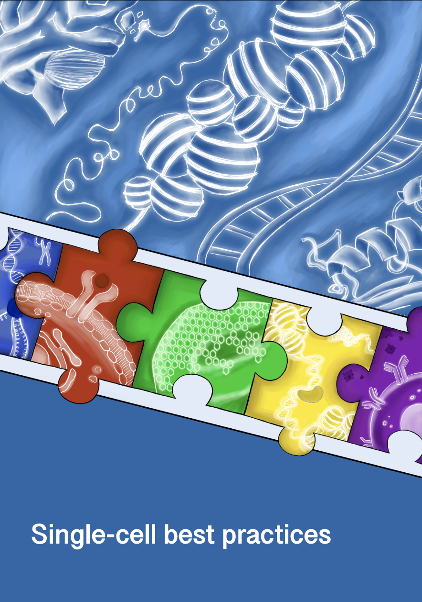

<div style="page-break-after: always;"></div>

# 单细胞最佳实践

## 介绍

人体是一台复杂的机器，严重依赖生命的基本单位——细胞。
这些细胞表现出显着的多样性，类型和功能各异，并且在发育过程中、对疾病的反应或再生过程中可以经历显着的转变。
这种细胞异质性体现在它们的结构、功能和基因表达谱上。
这种微妙的平衡被破坏可能导致全身失调，导致癌症 {cite}`Macaulay2017`等严重疾病。
因此，了解细胞在正常和扰动状态下的行为对于加深我们对整个细胞系统的理解至关重要。

为了应对这一挑战，研究人员采用了多种策略，其中最有希望的策略之一是在个体水平上分析细胞。
传统上，每个细胞的转录组主要在称为单细胞 RNA {term}`sequencing`的过程中进行检查。然而，单细胞基因组学的最新进展现在使得转录组数据与空间、染色质可及性或蛋白质水平信息的整合成为可能。
这些发展不仅增强了我们对复杂监管机制的理解，而且还给数据分析带来了额外的挑战。

目前，分析人员面临着大量的计算工具 - 超过 1,700 种专用于单细胞 RNA-seq 的方法（仅 {cite}`Zappia2021_pre`）。
驾驭这一广泛的领域以产生可靠、前沿的结果是一项重大挑战。

## 本书涵盖的内容

本书旨在指导初学者和经验丰富的专业人士了解单细胞测序分析的**最佳实践**。
它全面概述了基本分析步骤，从预处理到可视化和统计评估等。
通过阅读本书，您将获得独立分析单峰和多峰单细胞测序数据的技能。

所提出的建议尽可能以外部基准和审查为基础，确保所教授的方法既有效又可靠。
此外，本书旨在成为一种活的资源，不断更新以跟上新发现和最新的最佳实践。

## 本书未涵盖的内容

本书不涵盖生物学或计算机科学的基本概念，包括基本的编程技能。
它也不是用于特定任务的所有可用工具的详尽目录。
相反，它强调经过充分验证的方法，这些方法已经过外部基准测试或被认可为社区标准。
当无法进行此类外部验证时，我们的建议仅基于我们丰富的实践经验。

## 谁应该读这本书

本书是为对单细胞数据分析感兴趣的不同读者而设计的，包括希望获得实用数据分析技能的**生物学家**、寻求探索单细胞数据的生物基础和计算挑战的**计算机科学家**，以及旨在完善知识或保持最新最佳实践的**生物信息学家**。
无论您是希望掌握基础知识的初学者，还是希望提高技能并采用高效工作流程的经验丰富的分析师，本书都将指导您了解单细胞分析的复杂性。

## 本书的结构

每一章对应于典型单细胞数据分析项目的不同阶段。
虽然分析工作流程通常应遵循章节的顺序，但根据具体的下游分析目标，鼓励灵活性。
每章都补充有大量参考资料，鼓励读者查阅这些主要来源以获得更深入的理解。
尽管我们努力提供全面的背景信息，但我们的摘要和 [glossary](glossary.md) 可能无法涵盖每项建议背后的全部推理。

## 先决条件

生物信息学本质上是多学科的，需要生物学和计算机科学的知识。
单细胞分析的要求特别高，因为它集成了多个子领域并且通常涉及大型数据集。
虽然本书无法涵盖计算单细胞分析的所有必要基础知识，但我们推荐以下资源来增强您的学习体验：

- **Basic Python 编程**：熟悉控制流（例如循环、条件语句）、基本数据结构（例如列表、字典、集合）和关键库（例如 Pandas 和 Numpy）至关重要。
  新人可以从免费书籍 [Automate the boring stuff with Python](https://automatetheboringstuff.com/) 中受益。

- **AnnData 和 Scanpy**：虽然使用这些工具的先前经验很有帮助，但这并不是严格要求。
  本书详细介绍了 AnnData 并概述了使用 Scanpy 的工作流程。
  然而，它并没有涵盖 Scanpy 的全部功能。为了加深您的理解，我们建议探索 [scanpy tutorials](https://scanpy.readthedocs.io/en/stable/tutorials.html) 并根据需要参考 [scanpy API reference](https://scanpy.readthedocs.io/en/stable/api.html)。

- **Multimodal Data Analysis**：对于对多模态数据分析感兴趣的读者，了解 {term}`muon`和 MuData 等工具是有益的。
  [muon tutorials](https://muon-tutorials.readthedocs.io/en/latest/) 对该领域提供了可靠的介绍。

- **基础 R 编程**：了解控制流和基本数据结构就足够了。
  新学习者可以参考[R for data science](https://r4ds.had.co.nz/)进行全面介绍。

- **Basic Biology**：虽然本书提供了数据生成的粗略概述，但它不涵盖 {term}`DNA`、RNA 和蛋白质等基本主题。
  Bruce Alberts 等人的《细胞分子生物学》是分子生物学新手的推荐资源。

## 同行评审

尽管内容已经过多位作者、编辑和外部专家的审阅，但这本书尚未经过正式的同行评审。
我们鼓励您提供建设性的反馈意见，以帮助完善和改进材料。
分享您的想法：

1. **提出问题**：您可以在 [our GitHub repository](https://github.com/theislab/single-cell-best-practices) 上提出问题，以获取任何建议、问题或说明。
2. **Be Specific**：提供反馈时，请尽可能具体。
   例如，如果您有改进某个部分的建议，请指出具体部分并解释为什么您认为可以对其进行改进。
3. **Provide Sources**：如果适用，我们鼓励您提供来源或参考资料来支持您的反馈或建议。
   这有助于确保材料保持准确和最新。
4. **与社区讨论**：随时对现有问题发表评论以加入正在进行的讨论。
   这可以帮助我们根据社区的意见完善内容。

## 引文

如果您发现我们的内容对您的研究有帮助，请将其引用为：

> Heumos, L.、Schaar, A.C.、Lance, C. 等人。跨模式单细胞分析的最佳实践。 Nat Rev Genet (2023)。 https://doi.org/10.1038/s41576-023-00586-w

## 贡献

我们邀请社区为本教程和教材的持续改进做出贡献。
请阅读 [contributing](https://github.com/theislab/single-cell-best-practices/blob/development/CONTRIBUTING.md) 了解更多说明。

如有疑问或问题，请通过在此存储库中发布问题来联系。

## 替代格式

本书的 PDF 版本可在我们的 [releases page](https://github.com/theislab/single-cell-best-practices/releases) 上获取。

## 联系我们

您可以在我们的 [issue tracker](https://github.com/theislab/single-cell-best-practices/issues) 中报告问题和请求。

如需咨询、演讲或合作机会，请发送电子邮件至：

- Anna Schaar：anna.schaar@helmholtz-munich.de
- Lukas Heumos：lukas.heumos@helmholtz-munich.de

## 执照

本书已根据 [Apache 2.0 license](https://github.com/theislab/single-cell-best-practices/blob/development/LICENSE) 获得许可。

## 参考

```{bibliography}
:filter: docname in docnames
```
